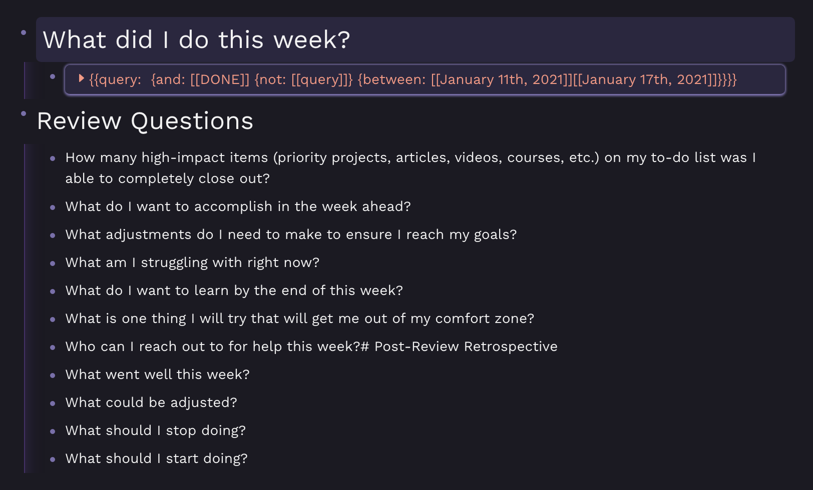

## roam-weekly-review
Alfred workflow that generates a Roam weekly review template



[Get the code here](https://github.com/kylestratis/roam-weekly-review)

This workflow allows you to use a snippet trigger with [Alfred](https://www.alfredapp.com/) to generate a weekly review. Due to how Python's `datetime`
module works, it should work to do a weekly review on both Sunday (the assumed end of the week) and Monday (the first day of the week after the one being reviewed).

This review has the following sections:
* What did I do this week? - This is a query of all done TODO items from the week you are reviewing. 
* Review Questions - Questions to ask yourself as you review the previous week. 
* Post-Review Retrospective - Questions to find areas of improvement for the coming week.

## Installation
To install, all you need to do is download the Roam Daily Notes.alfredworkflow file from this repo and
open it with Alfred. Define the snippet trigger you want to use (I like `\\xrwr`) and use it whenever you
want to review the past week. The script that generates the template is also available to look
at in this repo. 

## Output
An example output looks like this: 
```
# What did I do this week?
  - {{[[query]]: {and: [[DONE]] {between: [[August 3rd, 2020]][[August 9th, 2020]] {not: [[query]]}}}}
# Review Questions
  - How many high-impact items (priority projects, articles, videos, courses, etc.) on my to-do list was I able to completely close out?
  - What do I want to accomplish in the week ahead?
  - What adjustments do I need to make to ensure I reach my goals?
  - What am I struggling with right now?
  - What do I want to learn by the end of this week?
  - What is one thing I will try that will get me out of my comfort zone?
  - Who can I reach out to for help this week?# Post-Review Retrospective
  - What went well this week?
  - What could be adjusted?
  - What should I stop doing?
  - What should I start doing?
```  

Enjoyed this workflow? [Buy me a beer!](https://www.buymeacoffee.com/kylestratis)
